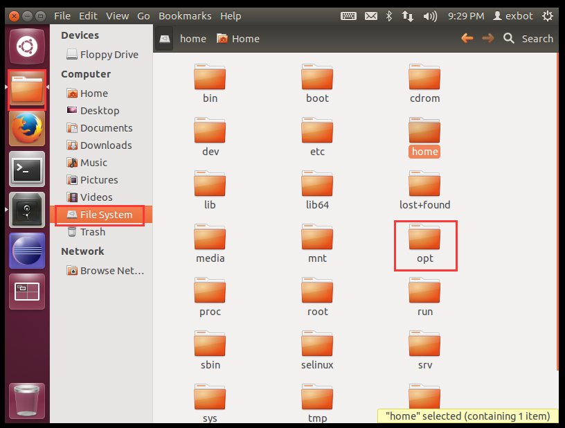
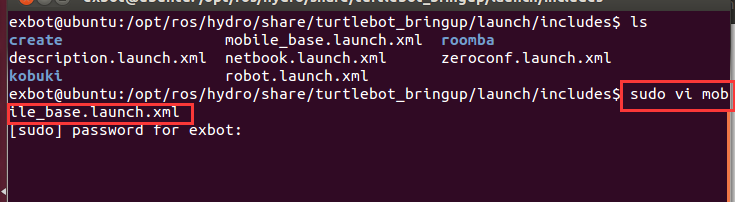
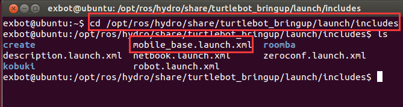
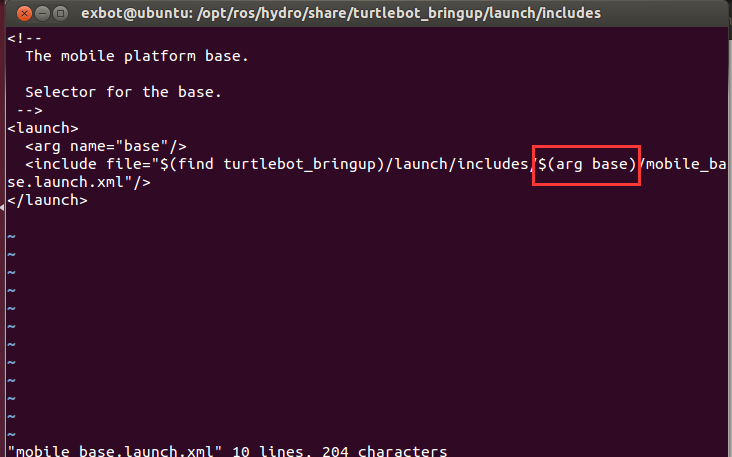
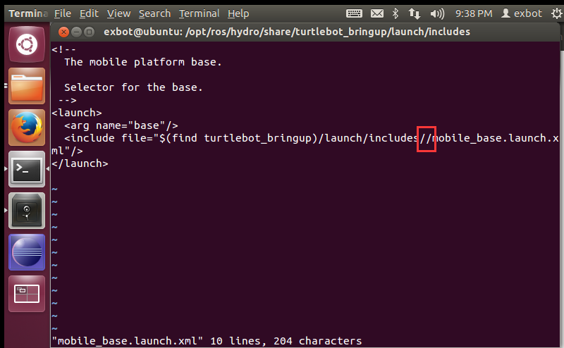
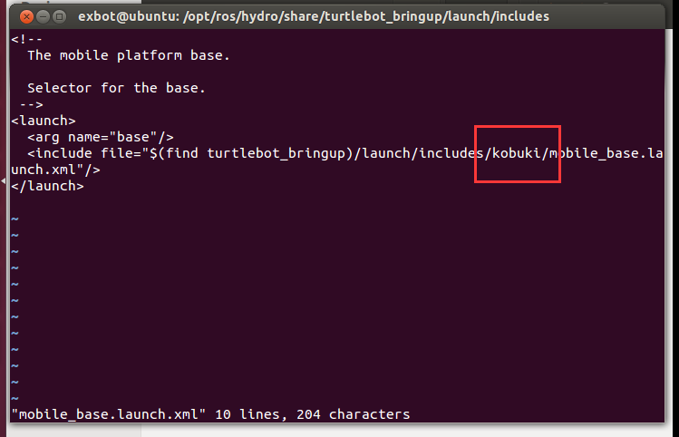

### PC无法找到Create底盘的解决办法

由于实验室turtlebot的底盘是kobuki，而默认Ubuntu12.04 with ROS 镜像中ROS默认启动的是Create底盘，因此导致笔记本连接不上turtlebot，解决方法如下：
 
在文件系统中找到opt文件夹，其中ROS目录存放所有关于ROS的文件。

我们需要修改位于`/opt/ros/hydro/share/turtlebot_bringup/launch/includes` 里的 `mobile_base.launch.xml` 文件，使其默认选择 **kobuki** 底盘。

使用 `ctrl + alt + t` 打开终端（因为出/home文件夹下的文件，其他文件都需要最高权限才能进行修改），输入：`cd /opt/ros/hydro/share/turtlebot_bringup/launch/includes`
如图：

 
再输入sudo vi mobile_base.launch.xml，在提示下输入密码（linux下输入密码是不会显示任何字符的，包括’*’）
如图：

 
之后出现如图界面：

 
使用hjkl（对应左、下、上、右）或者方向键控制光标到图中红框位置，按 x 删除”$(arg base)”如图：

 
再按 i 进入编辑模式，输入kobuki，如图：

 
按ESC 键进入命令模式（可以多按几次ESC），并输入 “:wq”（没有引号）退出vim，到此已经更改成功。
